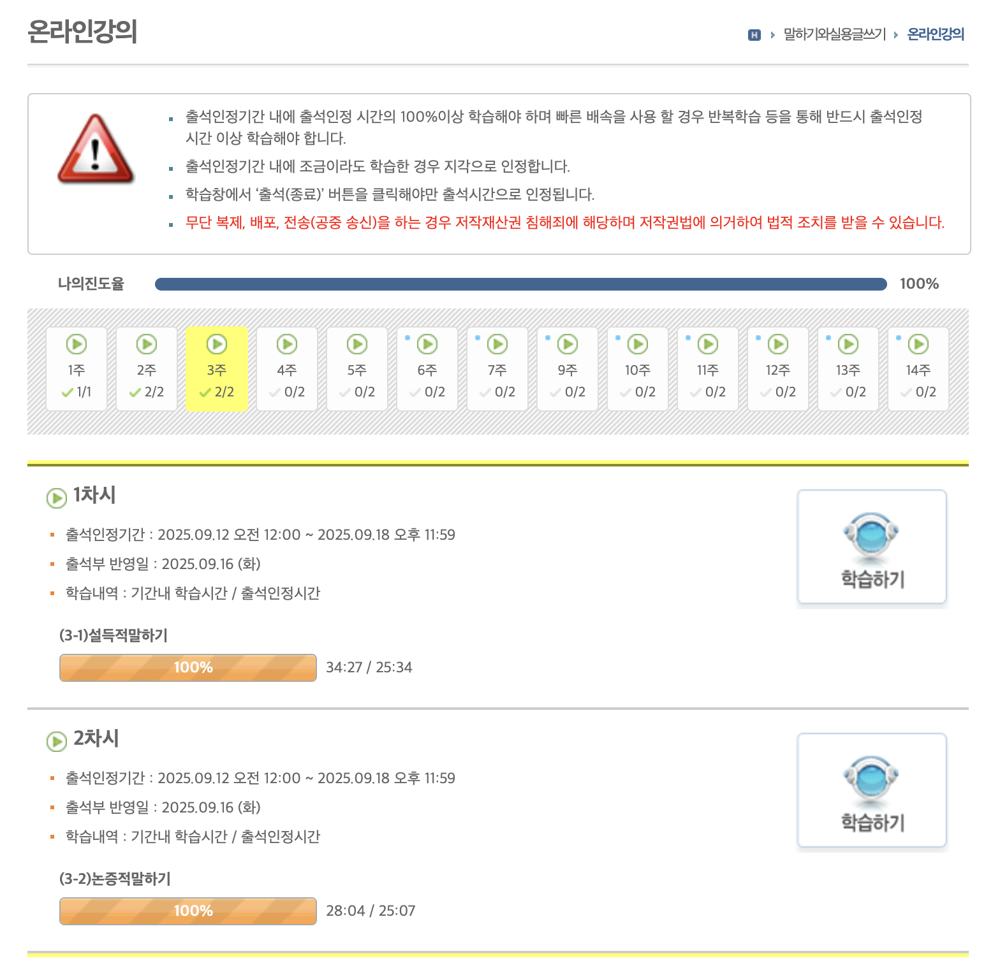
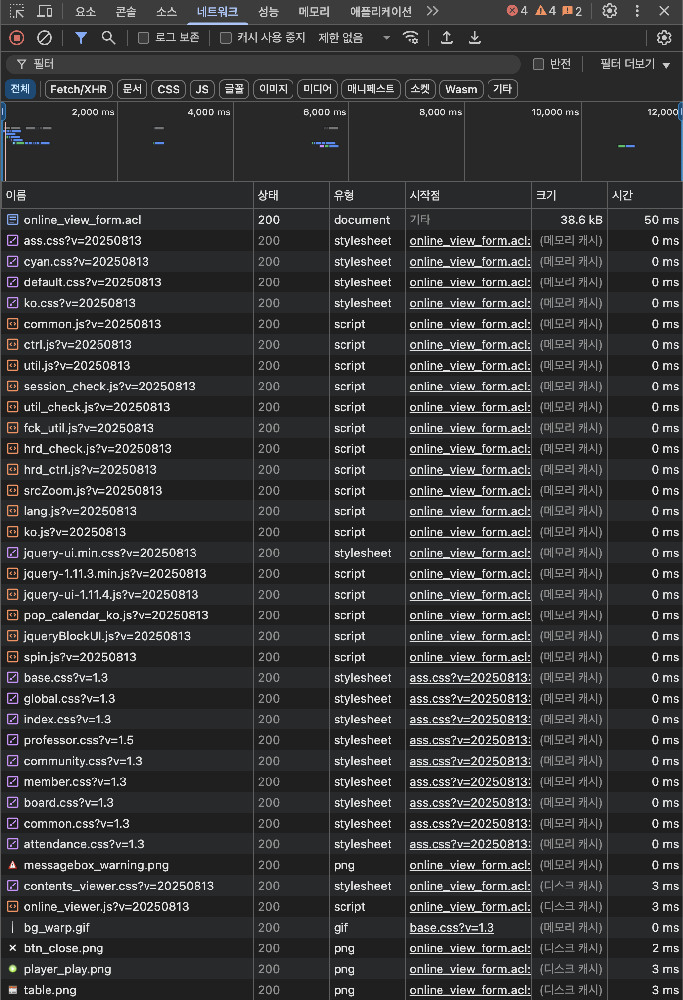
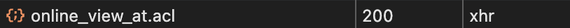
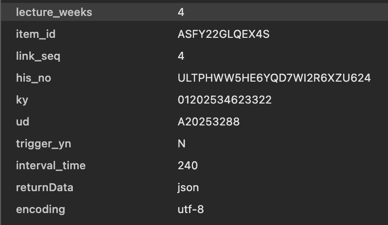
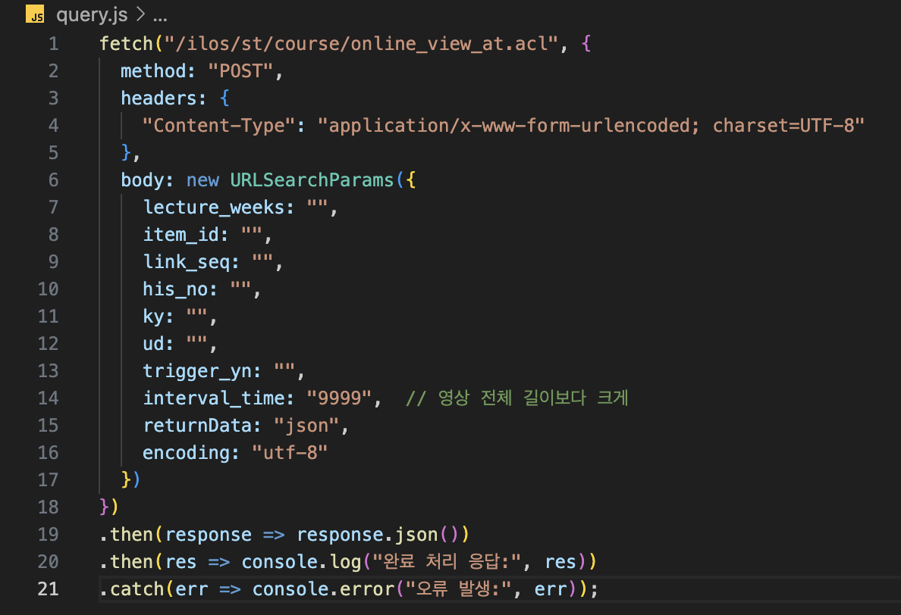
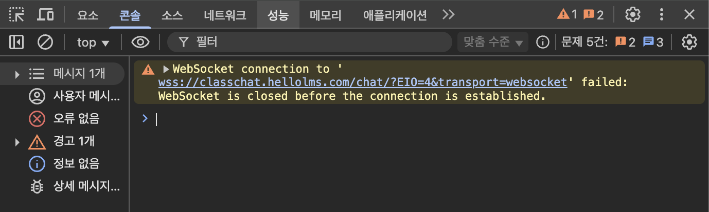

# LMS-Viewer-Hack

LMS에서 영상을 시청하지 않고도 **시청 완료 처리**가 가능한 콘솔 도구입니다.  
사용할 파일: `online_view_at.acl`

---

## Usage

### 1. 강의 접속
  
자신이 시청할 온라인 강의에 접속 후 **학습하기** 버튼을 클릭하여 영상 시청을 시작합니다.  

---

### 2. 개발자 도구 열기
  
F12를 눌러 **개발자 도구**를 열고, **네트워크(Network) 탭**으로 이동합니다.  

---

### 3. online_view_at.acl 확인
  
  
`online_view_at.acl` 파일 내용을 확인합니다.  

---

### 4. query.js 값 할당
  
`online_view_at.acl`에서 확인한 값을 `query.js`의 body에 할당합니다.  

---

### 5. 콘솔에 실행
  
  
1번 단계의 탭으로 돌아가 F12를 눌러 **콘솔(Console) 탭**을 엽니다.  
작성 완료된 `query.js` 내용을 **복사 → 콘솔에 붙여넣기** 후, 접속 게이지가 다 찰 때까지 반복합니다.  

---

## ⚠️ 주의사항
- 이 도구는 학습 플랫폼 정책과 상충할 수 있으니 개인 학습용으로만 사용하세요.  
- 잘못된 사용으로 계정 제한이나 문제 발생 시 책임은 사용자에게 있습니다.  

---

> 간단히 말해, 파일 확인 → 값 할당 → 콘솔 실행 순서로 시청 완료를 처리합니다.  
> 모든 단계에서 이미지 참고를 권장합니다.
